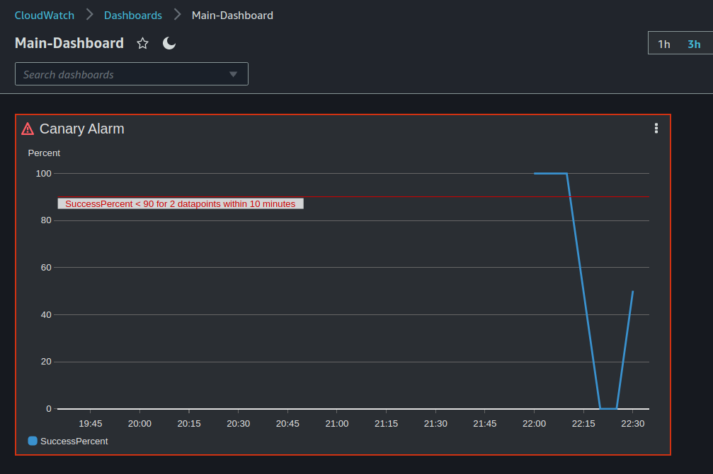
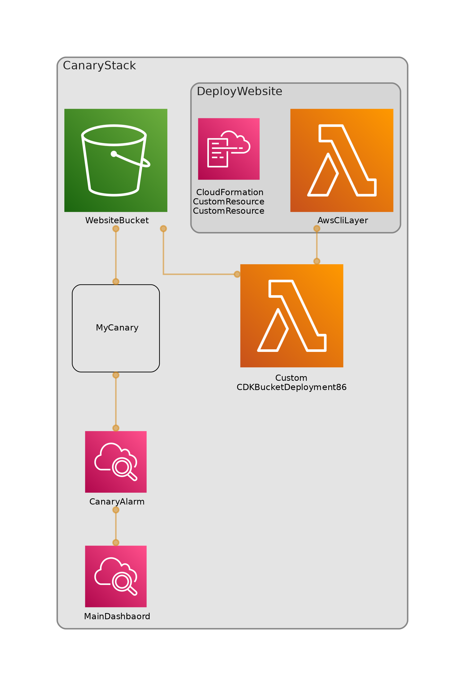

# Canary Stack

This stack:

- Deploys a simple HTML website
- Sets up and AWS canary to poll it from lambda every 5 minutes
- Configures a cloudwatch alarm on the canary
- Creates a cloudwatch dashboard showing the alarm widget

| Artefact           | Example                                                                                  |
| ------------------ | ---------------------------------------------------------------------------------------- |
| S3 bucket website  | http://canarystack-websitebucket75c24d94-z8brk94c8nvu.s3-website-eu-west-1.amazonaws.com |
| Deployed dashboard |                                                                      |
| Architecture       |                                                                        |

## Additional

I have additionally added AWS Real User Monitoring because I wanted to try out that feature.
